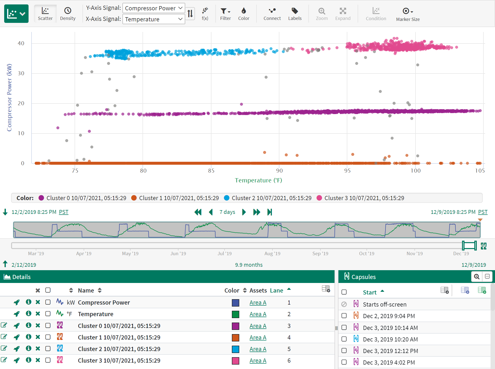

[](https://www.seeq.com)

[](https://www.seeq.com)

----

**seeq-clustering** is a plugin for Seeq, which allows for density based clustering of n-dimensional data. Clustering can be supervised (visual) or unsupervised (density based).

----

# User Guide

**seeq-clustering User Guide**

How to use Clustering

----

# Installation

The backend of **seeq-clustering** requires **Python 3.7** or later.

## Dependencies

See [`requirements.txt`](https://github.com/seeq12/seeq-clustering/blob/main/requirements.txt) file for a list of
dependencies and versions. Additionally, you will need to install the `seeq` module with the appropriate version that
matches your Seeq server. For more information on the `seeq` module see [seeq at pypi](https://pypi.org/project/seeq/)

## User Installation Requirements (Seeq Data Lab)

If you want to install **seeq-clustering** as a Seeq Add-on Tool, you will need:

- Seeq Data Lab (>= R50.5.0, >=R51.1.0, or >=R52.1.0)
- `seeq` module whose version matches the Seeq server version
- Access (and permissions) to machine running Seeq server
	- Knowledge or where [external calculation](https://seeq.atlassian.net/wiki/spaces/KB/pages/509509833/External+Calculation+Engine) scripts are located on that machine (see [User Installation](#user-installation) below)
- Enable Add-on Tools in the Seeq server

## User Installation

The latest source code of the project can be found [here](https://github.com/seeq12/seeq-clustering). The code is published as a
courtesy to the user, and it does not imply any obligation for support from the publisher. For proper installation, follow these steps exactly.

1. Create a **new** Seeq Data Lab project and open the **Terminal** window
2. Clone the seeq-clustering repository, run `git clone https://github.com/seeq12/seeq-clustering.git`
3. Move two files (cut and paste, or download directly and move) `Clustering.py` and `_Clustering_config.py` to the external calculation folder on the machine where Seeq server is running (typically `'D:/Seeq/plugins/external-calculation/python/user/'` or similar)
4. In command line on the computer or server running Seeq (*not* seeq data lab terminal), navigate to the external calculation python folder (using the example from above): `cd D:/Seeq/plugins/external-calculation/python/user/`
5. Configure the location (on machine running Seeq Server) where clustering models will be stored. Run `python _Clustering_config.py clusteringModelsPath` The default is to store the models in the same location as dir as Clustering.py, *i.e.* `D:/Seeq/plugins/external-calculation/python/user/` in this example. If you wish to store your models elsewhere, and you have the required permissions Assuming you have permissions to access the path, this can be done by running `python _Clustering_config.py clusteringModelsPath <yourpathhere>`

If you are unable to run `python _Clustering_config.py` (*e.g.* if you do not have python installed on the Seeq server host machine), see [manual instructions](#manual-external-calc-clustering-config)

6. Follow the instructions in external-calc readme (typically located `~/D:/ProgramData/Seeq/data/plugins/external-calculation/python/readme.html`) to install `hdbscan`. Here is an exceprt from the readme, explaining how to do this:

	*Installation of additional libraries can be done by executing the following steps:*

	***Stop Seeq if already started***

	*You may stop seeq by using the Seeq Workbench.*

	***Install the new Python module(s)***

	*Go to the place where Seeq Server is installed (usually C:\Program Files\Seeq Server) and run `seeqprompt.bat`*

	*This will open a new cmd window and will setup the Python environment for the next commands.*

	*To install your own Python libraries, run in this window (seeqprompt window) the following command:*

	```
	python -m pip install hdbscan -t plugins\lib\python3
	### if you need to install additional packages, e.g. seeq, replace hdbscan with <packagename>
	```
	*where hdbscan is the name of the module we wish to install.*

	***Check and repair permissions***

	*If you run seeq as a service you will need to go to c:\ProgramData\Seeq\data\plugins\lib, select python3 folder, press right mouse, go to Properties , select Security tab, press Advanced, mark checkbox "Replace all child object permissions ..." press Apply, then Yes and then OK.*

	***Start Seeq***

	*Once you've finished these steps the newly installed module may be used in your external-calculation Python scripts.*

If you run into an error in installation of `hdbscan` see [note](#errors-in-hdbscan-ext-calc-install)

----

# Development

We welcome new contributors of all experience levels. The **Development Guide** has detailed information about
contributing code, documentation, tests, etc.

## Important links

* Official source code repo: https://github.com/seeq12/seeq-clustering
* Issue tracker: https://github.com/seeq12/seeq-clustering/issues

## Source code

You can get started by cloning the repository with the command:

```shell
git clone git@github.com:seeq12/seeq-clustering.git
```

## Installation from source

For development work, it is highly recommended creating a python virtual environment and install the package in that
working environment. If you are not familiar with python virtual environments, you can take a
look [here](https://docs.python.org/3.8/tutorial/venv.html)

Once your virtual environment is activated, you can install **seeq-clustering** from source with:

```shell
python setup.py install
```

----

# Changelog

The change log can be found [**here**](https://seeq12.github.io/seeq-clustering/changelog.html)


----

# Support

Code related issues (e.g. bugs, feature requests) can be created in the
[issue tracker](https://github.com/seeq12/seeq-clustering/issues)
Any other general comments or questions (non-code related) can be emailed to
[Seeq](mailto:applied.research@seeq.com?subject=[seeq-clustering]%20General%20Question)

Maintainer: Eric Parsonnet


----

# Citation

Please cite this work as:

```shell
seeq-clustering
Seeq Corporation, 2021
https://github.com/seeq12/seeq-clustering
```


